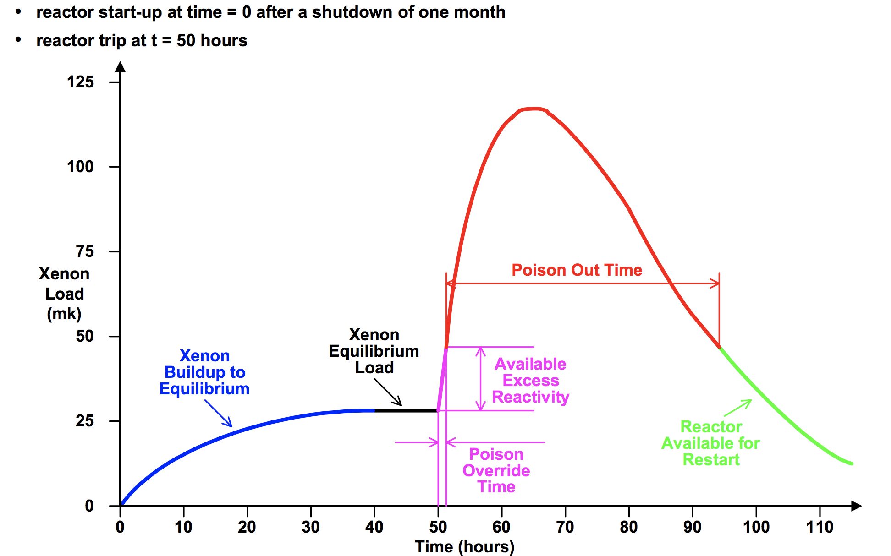

---
references:
  
- id: garland2005
  title: Elementary Physics of Reactor Control Module - Fission Product Poisoning
  author:
  - family: Garland
    given: Bill
  volume: 3
  URL: 'http://www.nuceng.ca/br_space/2017-09_4d03_6d03/misc_files/xenon_poisoning.pdf'
  publisher: Nuclear Engineering (Originally from McMaster University)
  type: article-journal
  issued:
    year: 2005
---


```{r setup, include=FALSE}
library(knitr)
knitr::opts_chunk$set(echo = TRUE)


## This chucnk will read through *this* Rmd file, and attempt to extract all of the 
## labels (not caption text) used for Figure captions. These labels are used
## as anchors, so scanning through the document now will allow us to create cross references
## before the caption actually appears. 

## Get the name of this Rmd file
rmdFn <- knitr::current_input()  # filename of input document

## Read lines and close connection
rmdCon <- file(rmdFn, open = "r")
rmdLines <- readLines(rmdCon)
close(rmdCon)

## Pull out all occurences of at least one back tick, followed 
## by any number of characters, followed by fig$cap (all on one line)
figscap_idx <- grep("`+(.*)fig\\$cap", rmdLines)
rmdLines <- rmdLines[figscap_idx]

## Get rid of everything up until the start of the caption label
## This presumes the caption label is the first argument of fig$cap()
## E.g., fig.cap = fig$cap("my_label", ...)
rmdLinesSansPre <- sub("(.*)fig\\$cap(.*?)[\"']", "", rmdLines)

## Identify everything up until the first quote
match_data <- regexpr("(.*?)[\"']", rmdLinesSansPre)

## Reduce the length by one, because we're not interested in the final quote
attr(match_data, "match.length") <- attr(match_data, "match.length") - 1

## Extract
fig_labels <- regmatches(rmdLinesSansPre, match_data, invert=FALSE)

if (length(fig_labels) > 0) {

    ## Test for duplicates
    if (anyDuplicated(fig_labels) > 0) stop("Duplicate caption labels detected")
    
    ## Create a named list of Figure numbers
    ref <- as.list(1:length(fig_labels))
    names(ref) <- fig_labels
}  

```

# Contents

# Introduction

Drag is the resistance that a fluid (air or water, in our case) gives to a body that is passing through it. Quite simply, it's a force that acts in the opposite direction.  There are multiple sources of drag for different types of scenarios.  For scenarios where an object is in contact with two different types of fluid (like a ship, on the ocean) or when the fluid doesn't really have contact with all of the object (supersonic flight, and supercavitating torpedoes) some more complex physics applies. For a fuller discussion of types of drag, see [@carlton2007]  But in the case of a submarine, which does it's business completely immersed in the ocean, the relevant physics is dominated the skin friction on the hull, which follows a very simple rule and relationship.  The amount of drag ($F_D$) an objet experiences increases directly in proportion to the surface area $A$.  For any given object of a certain (unchanging shape) there will be a constant coefficent ($C_D$) which reflects how aerodynamic or hydrodymanic the shape is.  The drag is also directly proportional to the density of the fluid being moved through, $\rho$.  (Air creates roughly one-thousandth the drag as water does on any given object at a given speed, since it's roughly one thousand times less dense.)

But the most sensitive factor in this relationship is the speed at which the object moves through the liquid.  The drag increases not with the speed ($v$), but with the **square** of the speed . This means if the speed doubles, the drag increases by four.  If the speed triples, the drag increases by a factor of nine.

$$F_D = \frac{1}{2}\rho v^2C_DA$$

(Technical aside: This law applies wherever the the flow over the surface is turbulent. It is true that for very small objects, or very viscous fluids, or very slow movements a different apples called Stokes Equation, in the case wher Reynolds numbers are less than 1.  Given that sea-water is not particularly viscous, and sumbarines not particularly small, Reynolds numbers are liekly to be much much greater than 1 (one or two thousand), even when moving at only one or two knots.  Since it is unlikely that a significant proportion of the flow over the hull will be laminar, we'll use the drag equation in all modeling going forward when considering drag on the hull). 

The situation becomes much more complicated when the reactor undergoes a sudden change in power output.  If the power is lowered dramatically and suddenly, the production of Xenon continues quite rapidly for some time due to the decay of the large stock of Iodine-135.  With less neutron flux available to 'burn off' the Xenon, the Xenon levels spike, and push down the reactor's reactivity.  Unless the reactor is quickly raised back to relatively high power (~60%) quite quickly (an hour or less), the Xenon levels become so high that the reactor will have to be shut down, otherwise extreme (and dangerous) measures would be required in order to keep the reactor going.  (This is essentially what lead to the Chernobyl Explosion [@WNA2009].)  A fuller discussion of Xenon poisoning can be found in [@garland2005], which demonstrates key concepts related to the poisoning effect shown in Figure  x.

{width=500px}


`r fig$cap("inline_cap", "Here is a sample inline caption", center=TRUE, inline=TRUE)`


<!-- \begin{figure} -->
<!-- \includegraphics[width=0.9\textwidth]{XenonPoison.png} -->
<!-- \caption{Xenon poisoning effect following shutdown}   -->
<!-- \label{fig:xenon} -->
<!-- \end{figure} -->
<!-- \ref{fig:xenon} -->
<!-- \pageref{fig:xenon}  -->

<!-- {width=500px} -->

Consequently, nuclear reactors aren't well suited to rapid fluctuations in power, particularly dramatic reductions in power, as these can lead to instability in the reactor core.  If the reactor is shut down in order to avoid such dangerous circumstances, it generally cannot be started again until Xenon levels have fallen again, which can take a couple of days.  Obviously this is never desirable for a military vessel, and hence is avoided at almost all costs. 
